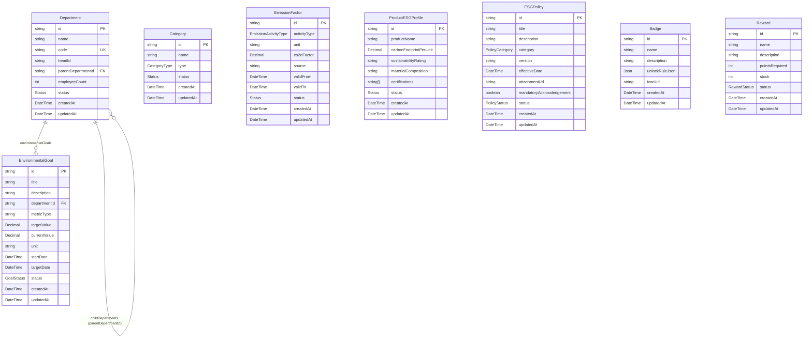

# EcoSphere Master Data Entity-Relationship Diagram (ERD)

This document contains the Entity-Relationship Diagram (ERD) covering the 8 Master Data models defined in the EcoSphere backend using Prisma.

