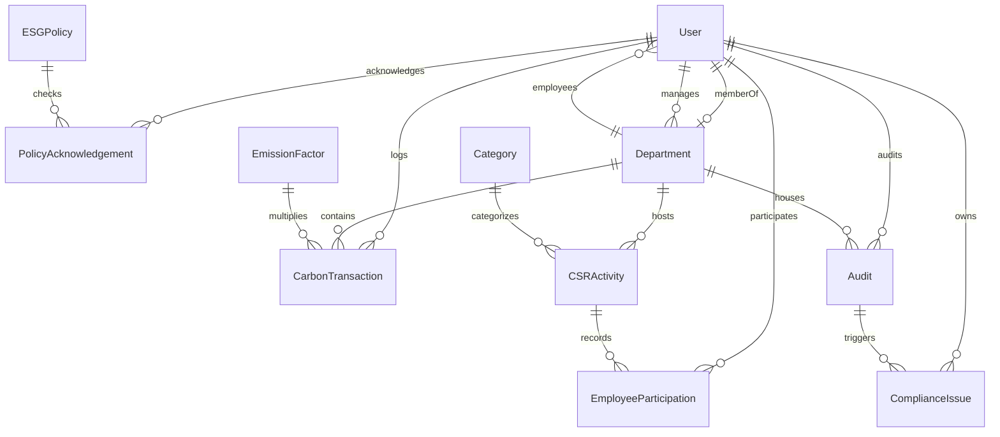

# EcoSphere Database Entity Relationship Diagram

## Schema Entity Details

### 1. Master Data Tables
* **User**: id (UUID), name, email, passwordHash, role, departmentId, pointsBalance, timestamps
* **Department**: id (UUID), name, code, headId, parentDepartmentId, employeeCount, status, timestamps
* **Category**: id (UUID), name, type, status, timestamps
* **EmissionFactor**: id (UUID), activityType, unit, co2eFactor, source, validFrom, validTo, status, timestamps
* **ESGPolicy**: id (UUID), title, description, category, version, effectiveDate, attachmentFile, mandatoryAcknowledgement, status, timestamps

### 2. Transactional Data Tables
* **CarbonTransaction**: id (UUID), departmentId, emissionFactorId, sourceType, sourceRecordId, quantity, calculatedCO2e, transactionDate, autoCalculated, createdById, timestamps
* **CSRActivity**: id (UUID), title, description, categoryId, departmentId, date, location, targetParticipants, status, timestamps
* **EmployeeParticipation**: id (UUID), employeeId, activityId, proofUrl, approvalStatus, pointsEarned, completionDate, timestamps
* **PolicyAcknowledgement**: id (UUID), employeeId, policyId, acknowledgedAt, status, timestamps (Unique on employeeId + policyId)
* **Audit**: id (UUID), title, departmentId, auditorId, startDate, endDate, findingsSummary, status, timestamps
* **ComplianceIssue**: id (UUID), auditId, severity, description, ownerId, dueDate, status, timestamps
